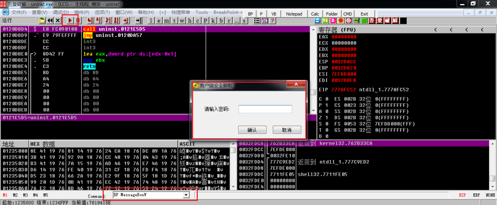
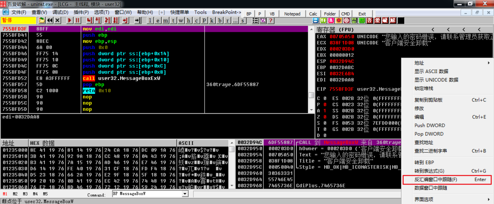
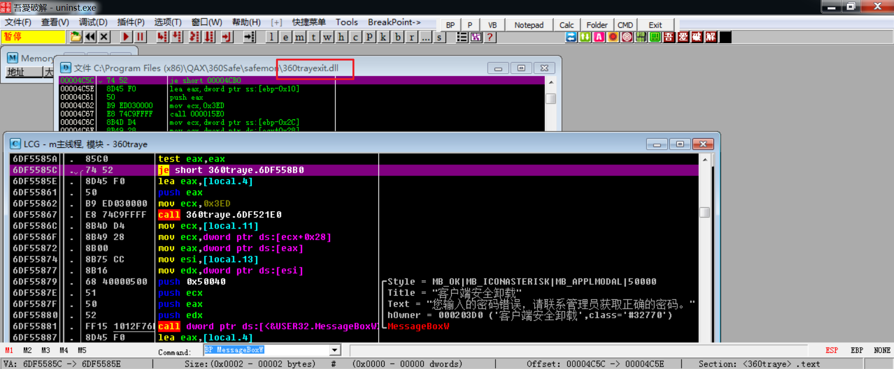
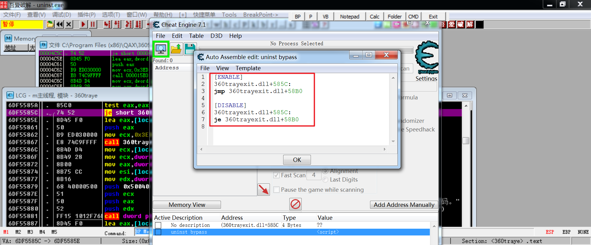
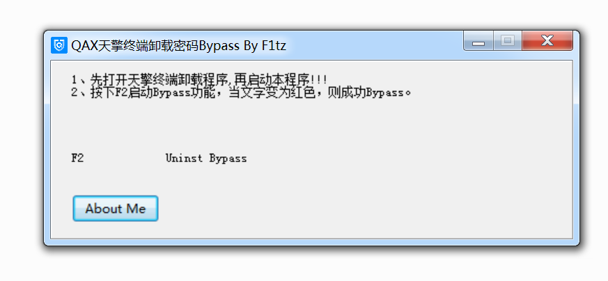

# What?我竟然用游戏修改器卸载了X擎

# 前言

> 声明：本人是Web选手，对逆向知识掌握浅薄，文中如有错误还请多多包含，不吝赐教。
>
> 声明2：该问题已经在8、9月提交过补天，给的回复是不关注、无影响，据说新版本中已经修复。

某次去客户那边做渗透，现场使用X擎做了准入系统，要求我们必须安装X擎，可是等到项目结束，想要卸载的时候，客户那边的技术负责人也不知道卸载密码，说是只有总部的人才有，最后就是建议我重装系统。

重装系统是不可能重装系统的，辣么麻烦。祭出OD用我三脚猫的逆向功夫搞一把试试？

> 这篇文章是基于之前测试的记录来写的，所以截图里客户端更新日期也是当时的

#Bypass原理

下面说说我是如何绕过卸载密码并成功卸载掉X擎的，总体思路是`爆破`。

1、正常启动卸载x擎客户端，发现是一个进程为uninst.exe的程序，使用OD加在并启动，设置一个消息框断点`BP MessageBoxW`，因为密码错误会弹窗。



2、输入任意错误密码，程序便会断线，堆栈窗口中跟随到函数调用处。



3、往上拉一点发现一个0x6DF5585C的地址，可以跳过关键函数，因此可以通过修改这里的je为jmp，达到bypass卸载密码的目的。


4、记住该函数包含在模块名为`360trayexit.dll`里




# 编写修改器

1、打开CheatEngine，使用自动汇编功能制作修改器，这里的地址使用的是模块名加地址的方式

```lua
[ENABLE]
360trayexit.dll+585C:
jmp 360trayexit.dll+58B0

[DISABLE]
360trayexit.dll+585C:
je 360trayexit.dll+58B0
```



2、使用CE直接，画一下界面，绑定F2热键来触发自动汇编脚本，然后生成修改器。这样在卸载窗口按下F2就可以输入任意密码卸载了



版本为测试时的最新版


# 总结

这篇文章首发T00ls，同时也会放在我的Github里，卸载演示视频、CT脚本、PoC程序我会打包放在这里：[./AIO.zip](./AIO.zip)

由于X擎客户端都是每家公司定制的，可能地址偏移会不同，如果想用CE做通用的卸载工具，个人觉得可以考虑使用特征码来定位关键代码再修改，我这里之前只是为了证明一下，就没做那么麻烦。

通过演示视频可以看出，X擎保护全开的情况下，不会对修改器进行查杀（WindowsDefender会查杀），整个过程也没有出现任何告警的。这里不需要使用任何驱动技术，直接修改内存就bypass了，证明X擎并没有保护卸载程序的进程。

下图这是补天的回复，X擎厂商在6.7版本后应该就解决了这个问题，由于我也搞不到6.7版本（自动升级好像不能提升程序版本）的安装包，所以无法进行测试。


