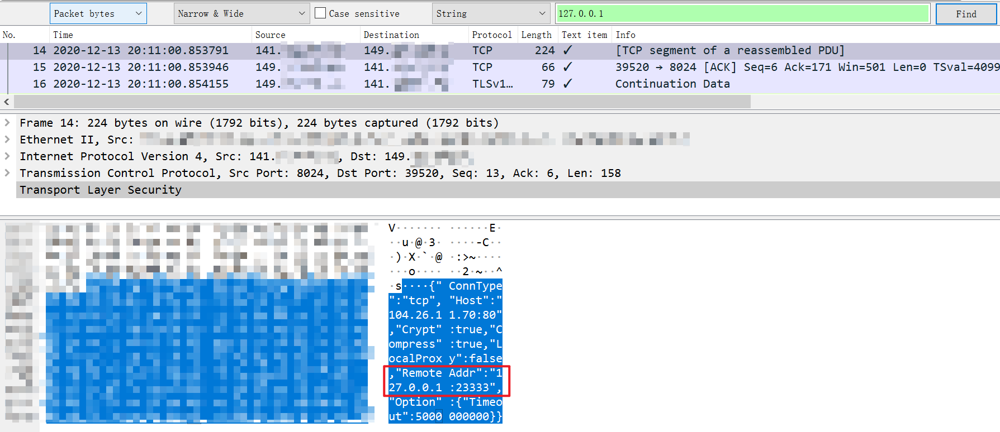

# 简单修改源码，让NPS不再泄露你的来源IP地址

# 前言

最近考虑部署一个NPS，为了提升内网打隧道时的效率。出于安全考虑，先对NPS的通信流量进行了简单的分析，结果发现了一个问题，NPS会主动将使用代理的来源IP地址发送到NPC端，导致攻击者源IP地址存在泄露风险，后面考虑通过修改NPS源码来解决这一问题。

> 关于NPS的作用与介绍，可参考这里
>
> https://github.com/ehang-io/nps
>
> https://ehang-io.github.io/nps/


# 流量分析

## 测试环境、测试方法

1、测试环境

3台VPS 47.x.x.x、141.x.x.x、149.x.x.x

47模拟攻击者源IP、141模拟公网VPS（NPS端）、149模拟目标网络内主机（NPC端）

2、测试方法

a.141与149之间建立socks5隧道

b.149上开启tcpdump抓包

c.47通过141的socks5代理，curl http://myip.ipip.net

d.排查pcap包中是否包含47.x.x.x的IP地址

## 原版NPS流量分析

下载 `https://github.com/ehang-io/nps/releases/download/v0.26.9/linux_amd64_server.tar.gz`

1、NPS安装过程略过，创建客户端，配置如下图


2、npc端回连nps端，并创建一个socks5代理，端口为9999


3、npc端上开启tcpdump准备抓包，并在47上通过141的9999代理端口访问http://myip.ipip.net

下图可见，47已成功走了149的网络


通过npc端打印的Debug信息(默认 `-log_level 7`)可以看到来至47的请求记录。

>
> btw: 在npc启动时加入`-log_level 0`的参数，只能阻止打印调试信息，实际nps还是会将源地址发送到npc端。
>


4、分析流量包

通过搜索47.x.x.x，可以找到在一个数据包中携带了JSON格式字串，其中`Remote Addr`字段携带了47.x.x.x的IP地址，如果目标存在全流量记录，那就有可能导致攻击者真实IP泄露（假设攻击者直连NPS代理）。


# 修改源码

现在就修改NPS项目源码，尝试解决上面的这个问题，我的思路是篡改NPS发送该数据包中`RemoteAddr`的数据。

> Go语言的了解不够深入，下文描述若有错误，还请多多包涵

源码直接从GitHub上clone即可`https://github.com/ehang-io/nps`。

1、定位关键代码，通过关键字`RemoteAddr`定位。

2、发现关键方法`NewLink`，并尝试在项目中搜索所有调用点，其中local.go是client使用的源码、link.go中定义了该方法，故忽略上面这两个，只对下面4处进行修改


3、四处代码修改的具体位置如下，将`RemoteAddr`直接替换为`127.0.0.1:23333`。


```go
// base.go:88
link := conn.NewLink(tp, addr, client.Cnf.Crypt, client.Cnf.Compress, c.Conn.RemoteAddr().String(), localProxy)
// 修改为
link := conn.NewLink(tp, addr, client.Cnf.Crypt, client.Cnf.Compress, "127.0.0.1:23333", localProxy)
```

```go
// http.go:161
lk = conn.NewLink("http", targetAddr, host.Client.Cnf.Crypt, host.Client.Cnf.Compress, r.RemoteAddr, host.Target.LocalProxy)
// 修改为
lk = conn.NewLink("http", targetAddr, host.Client.Cnf.Crypt, host.Client.Cnf.Compress, "127.0.0.1:23333", host.Target.LocalProxy)
```

```go
// socks5.go:219
link := conn.NewLink("udp5", "", s.task.Client.Cnf.Crypt, s.task.Client.Cnf.Compress, c.RemoteAddr().String(), false)
// 修改为
link := conn.NewLink("udp5", "", s.task.Client.Cnf.Crypt, s.task.Client.Cnf.Compress, "127.0.0.1:23333", false)
```

```go
// udp.go:68
link := conn.NewLink(common.CONN_UDP, s.task.Target.TargetStr, s.task.Client.Cnf.Crypt, s.task.Client.Cnf.Compress, addr.String(), s.task.Target.LocalProxy)
// 修改为
link := conn.NewLink(common.CONN_UDP, s.task.Target.TargetStr, s.task.Client.Cnf.Crypt, s.task.Client.Cnf.Compress, "127.0.0.1:23333", s.task.Target.LocalProxy)
```

4、重新编译

保存修改后的代码，然后进入./cmd/nps目录下，如果你像我一样想在Windows下编译Linux版本的nps，可使用如下交叉编译的方法（在cmd环境下执行）。

```
SET CGO_ENABLED=0
SET GOOS=linux
SET GOARCH=amd64
go build nps.go
```

5、上传nps到服务器，先`nps stop`停止服务，之后替换掉`/usr/bin/nps`，再`nps start`启动服务。

## 验证效果

首先查看npc的debug信息已经打印的是127.0.0.1:23333了


之后查看流量包，也无法搜索到47.x.x.x的地址了，只有127.0.0.1。



# 总结

1、对于直连VPS日内网的小伙伴，很可能因为NPS发送了来源IP，被全流量设备记录，导致最终被溯源。

2、对于陌生软件进行流量分析，可以发现一些表面上看不到的问题，有时甚至可以意外发现植入软件的后门。

3、本次修改的4处代码，是否会造成BUG，目前尚不清楚。

> ps：另外我还抓了EW的socks流量进行分析，没有发现泄露来源IP地址的情况。
>
> pps：此篇文章首发T00ls，之后会同步到我的Github中 https://github.com/f1tz/SecurityNotes